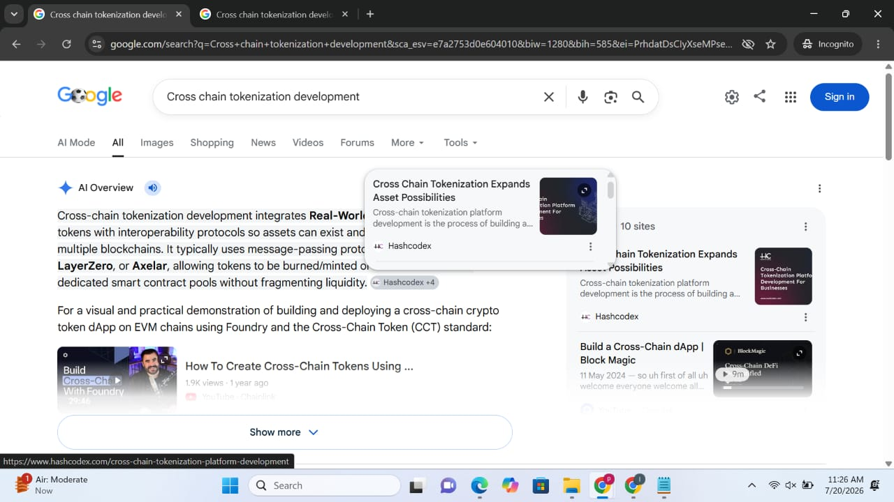
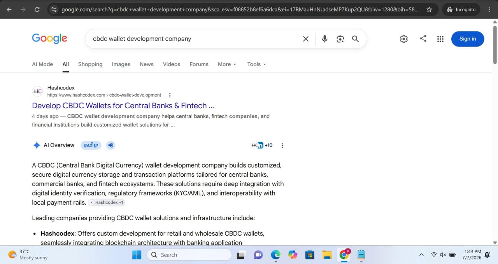
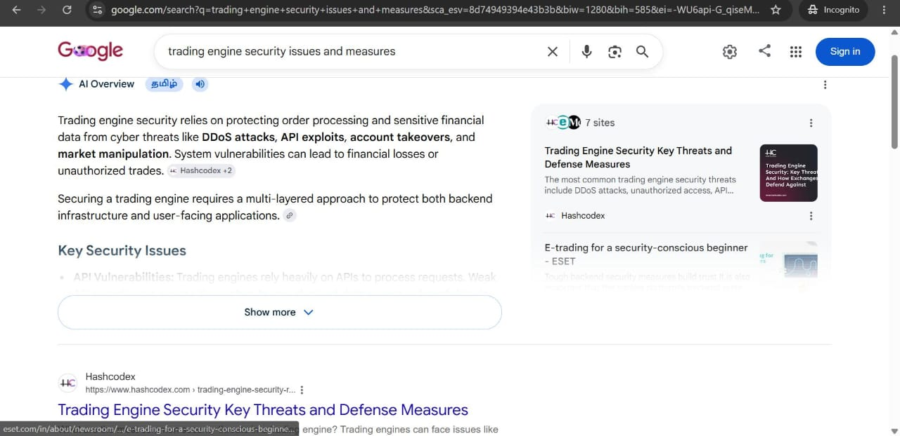
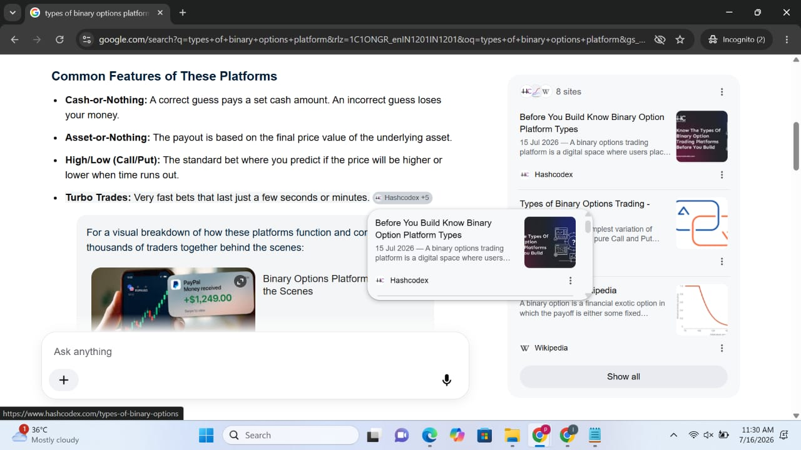

# ✨ PRADEEPA

### Content Writer | Web3 | FinTech | Blockchain | Digital Finance

Creating research-driven blogs, newsletters, and technical content that simplify complex technologies.

 

---

# 👋 About Me

Hello! I'm **Pradeepa**, an SEO Content Writer with an MCA background and experience creating research-driven content for **Web3, FinTech, Blockchain, and Digital Finance**.

I specialize in transforming complex technical concepts into clear, engaging, and search-friendly content that helps businesses improve their online visibility while delivering value to readers.

This portfolio showcases a selection of my published work across websites, Medium publications, and LinkedIn newsletters, along with the different content formats I've created during my professional journey.

---

# 🚀 Portfolio Overview

Over the past **6 months**, I have created **125+ content pieces** across multiple formats, contributing to SEO growth, audience engagement, and digital marketing initiatives.

My work includes **web blogs, promotional blogs, LinkedIn newsletters, press releases, microblogs, forum content, classified advertisements, and on-page SEO optimization.**

Below is a curated selection of my published work.

---

# 📈 SEO Highlights

✔ **25+ pages achieved first-page rankings** for their target keywords.

✔ **Multiple published articles were featured in Google's AI Overview.**

✔ **Improved underperforming blog pages from beyond the fourth page to within the top two pages of search results through strategic on-page SEO optimization.**

---

# ⭐ Featured Writing

## Cross-Chain Tokenization Platform Development for Businesses

**Published on:** Hashcodex

A comprehensive article exploring how businesses can leverage cross-chain tokenization platforms to improve asset liquidity, security, and interoperability across blockchain networks.

⭐ **Featured in Google's AI Overview**

🔗 **Read Article:**

https://www.hashcodex.com/cross-chain-tokenization-platform-development

---

# 📚 Web Blogs

Over the course of my experience, I have written **30+ SEO-focused web blogs** covering Web3, FinTech, Blockchain, and Digital Finance.

Below are a few selected articles that demonstrate my research, technical writing, and SEO content creation skills.

<table>

<tr>
<td width="50%">

## 🔗 Cross-Chain Tokenization Platform Development

**Published on:** Hashcodex

⭐ Featured in Google's AI Overview

Exploring blockchain interoperability and asset tokenization solutions for businesses.

<a href="https://www.hashcodex.com/cross-chain-tokenization-platform-development">
Read Article →
</a>

</td>

<td width="50%">

</td>
</tr>

<tr>
<td>

## 💳 CBDC Wallet Development Company

**Published on:** Hashcodex

⭐ Featured in Google's AI Overview

Understanding secure digital currency infrastructure for central banks and fintech ecosystems.

<a href="https://www.hashcodex.com/cbdc-wallet-development">
Read Article →
</a>

</td>

<td>

</td>
</tr>

<tr>
<td>

## 🔐 Trading Engine Security

**Published on:** Hashcodex

⭐ Featured in Google's AI Overview

A deep dive into security threats and defensive architectures used by trading platforms.

<a href="https://www.hashcodex.com/trading-engine-security-risks-and-defense-measures">
Read Article →
</a>

</td>

<td>

</td>
</tr>

<tr>
<td>

## 📈 Binary Options Trading Platforms

**Published on:** Hashcodex

⭐ Featured in Google's AI Overview

Understanding trading platform architectures, models, and essential features.

<a href="https://www.hashcodex.com/types-of-binary-options">
Read Article →
</a>

</td>

<td>

</td>
</tr>

</table>

---

# 📢 Promotional Blogs

Over the course of my experience, I have written **25+ promotional blogs** focused on increasing product awareness while delivering valuable and informative content to readers.

Below are a few selected publications.

<table>

<tr>
<td>

## 🚀 White Label Crypto Exchange Launch

**Platform:** Medium

<a href="https://medium.com/activated-thinker/what-if-a-white-label-crypto-exchange-could-cut-months-from-your-launch-timeline-c5aa92299109">
Read Article →
</a>

</td>
</tr>

<tr>
<td>

## 📊 Binary Options Trading Platform in 2026

**Platform:** Medium

A guide covering important considerations for launching a binary options trading platform.

<a href="https://medium.com/write-a-catalyst/how-to-launch-a-binary-options-trading-platform-in-2026-091b8204890b">
Read Article →
</a>

</td>
</tr>

<tr>
<td>

## 💱 Top Forex CRM Providers

**Platform:** Medium

Exploring trusted CRM solutions for forex businesses.

<a href="https://medium.com/coinmonks/top-forex-crm-providers-trusted-and-regulated-choices-6e4bc2e84537">
Read Article →
</a>

</td>
</tr>

</table>

---

# 📰 Newsletters

During my experience, I have written **5+ LinkedIn newsletters** covering industry news, product updates, and emerging trends in Web3, FinTech, and Digital Finance.

Below are a few featured newsletters.

<table>

<tr>
<td>

## 🏦 CMC Markets Highlights the Importance of API Partnerships in Fintech Development

**Platform:** LinkedIn Newsletter

<a href="https://www.linkedin.com/posts/hashcodex_hashcodex-cmcmarkets-financialservices-activity-7473262698680541184-QuSa">
Read Newsletter →
</a>

</td>
</tr>

<tr>
<td>

## 🌍 SBI-Backed Cashfree Payments Strengthens Its Cross-Border Strategy

**Platform:** LinkedIn Newsletter

<a href="https://www.linkedin.com/posts/hashcodex_crossborderpayments-paymentservices-digitalbanking-activity-7480143596118122496-TSRV">
Read Newsletter →
</a>

</td>
</tr>

<tr>
<td>

## 📈 Tiger Brokers Signals a New Compliance Reality

**Platform:** LinkedIn Newsletter

<a href="https://www.linkedin.com/posts/hashcodex_hashcodex-tigerbrokers-crossbordertrading-activity-7469998615088807937-BNRA">
Read Newsletter →
</a>

</td>
</tr>

</table>

---

# ✨ Additional Professional Experience

In addition to the published work showcased above, I have also contributed to:

- On-page SEO Optimization
- Microblogs
- Forum Content
- Classified Advertisements
- Press Releases
- Guest Blogs

---

# 🤝 Let's Connect

If you're looking for a content writer who enjoys simplifying technical concepts into engaging, search-friendly content, I'd be happy to connect.

Thank you for taking the time to explore my portfolio.

📧 **[pradeepapreethi0507@gmail.com](mailto:pradeepapreethi0507@gmail.com)**

💼 **LinkedIn:**
https://www.linkedin.com/in/pradeepa-baskaran-047208281

 

⭐ Thanks for visiting my portfolio!

